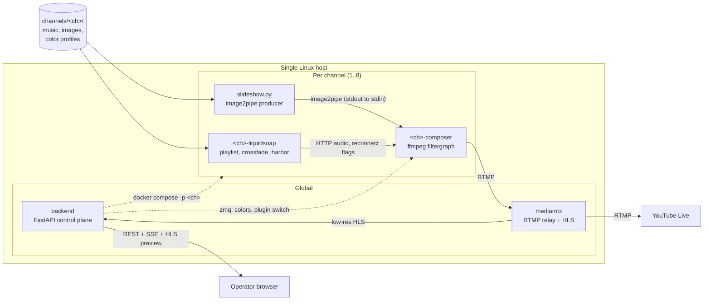

# Architecture

**Status: design document.** Nothing described here is implemented yet. The repository
currently contains only project instructions, agent definitions, and this documentation. This
document describes the system the lanes are building toward, so that every lane builds the
same system. Where a decision is deliberately still open, it is marked as such.

## 1. What the system is

ambient-streamer is a headless, multi-channel, 24/7 ambient music streaming system for
YouTube Live. It runs unattended on a single Linux host and is operated entirely through a
browser.

Each **channel** is one continuous YouTube broadcast. A channel pairs:

| Piece | Role |
|-------|------|
| Liquidsoap audio engine | Owns the playlist, track order, crossfades, and loudness. Emits a continuous audio stream over HTTP. |
| FFmpeg compositor | Renders a color-adaptive image slideshow plus real-time audio visualization, encodes, and publishes over RTMP. |
| Color profile | Per-image palette data that drives the visualization and background colors so they track the current image. |
| HLS preview | A low-resolution ladder rung the operator can watch without touching the YouTube broadcast. |

A **FastAPI control plane** orchestrates all channels: it renders each channel's Compose file,
starts and stops channels, watches their health, restarts what dies, applies scheduled
changes, and streams live state to the operator UI.

The system has no interactive console, no desktop session, and no manual step in normal
operation. An operator's only interface is the web UI and, at install time, a shell script.

## 2. The central constraint

> **A 24/7 stream must never restart FFmpeg.**

This single rule explains most of the design. It follows from two facts that pull against each
other.

**Fact one: YouTube ends a broadcast after a sustained gap in data.** A live broadcast is a
session, not a file. If the RTMP publisher disconnects and stays gone, YouTube marks the
stream unhealthy, then ends the broadcast. Ending a broadcast is not recoverable in place —
the video ID changes, watch-page continuity is lost, and any accumulated concurrent viewers
are gone. A 24/7 channel that restarts its encoder to change a color is not a 24/7 channel.

**Fact two: an FFmpeg filtergraph is fixed at launch.** The graph is parsed once, from
`-filter_complex`, before the first frame. Filters cannot be added, removed, or rewired while
the process runs. Inputs cannot be added. The output URL cannot change. Only a narrow set of
filter *parameters* can be mutated at runtime.

So every feature an operator can change live must be designed around one of a small number of
escape hatches. The design question is never "how do I restart FFmpeg cleanly?" — it is
"which escape hatch does this feature use?"

### 2.1 The escape hatches

| Live change | Mechanism | Why it works |
|-------------|-----------|--------------|
| Playlist, track order, crossfade | Liquidsoap owns audio in a separate process | FFmpeg sees one never-ending HTTP audio input. Liquidsoap can reload its playlist without FFmpeg noticing. |
| Image set, image order, transitions | Python producer feeds `-f image2pipe` | FFmpeg sees one never-ending stream of frames on stdin. The producer decides which image, in what order, with what crossfade. |
| Colors | `zmq` filter plus runtime commands | Mutates parameters on filter instances in the running graph. No re-parse, no restart. |
| Visualization plugin | `streamselect` between pre-instantiated graphs | Every plugin's branch exists in the graph from launch. Switching changes which branch is routed to the output. |
| Anything that genuinely needs a restart | MediaMTX relay | The composer publishes to MediaMTX, not to YouTube. MediaMTX holds the YouTube session open across a composer restart. |

**The decision rule:** before adding a feature that changes what the stream looks or sounds
like, decide which row it lands in. If the answer is "restart FFmpeg", the design is wrong —
change the design, not the rule.

### 2.2 Audio: a separate process

Liquidsoap runs in its own container and exposes a continuous stream over `output.harbor`
(HTTP). FFmpeg consumes that URL as an input with reconnect flags, so a Liquidsoap blip is a
reconnect rather than a process death.

Playlists use `playlist(reload_mode="watch")`, so adding or removing a track on disk is picked
up by Liquidsoap on its own schedule. Nothing downstream restarts. Crossfade, replaygain, and
loudness normalization all live on this side of the boundary — they are audio concerns, and
audio concerns belong to the process that can change them live.

The tradeoff is one extra container and one extra hop per channel. That is accepted: it is the
cheapest possible way to make the playlist editable without touching the encoder.

### 2.3 Images: a producer on a pipe

The slideshow is not built from FFmpeg's concat demuxer or a `glob` pattern, because both fix
the image set at launch. Instead a Python producer writes encoded frames to stdout and FFmpeg
reads them with `-f image2pipe`.

This inverts the ownership: the producer, not the filtergraph, owns image order, dwell time,
crossfade rendering, and the response to a changed media directory. Adding images to a channel
becomes a filesystem operation plus a producer-side rescan, with no effect on the encoder.

Because a slideshow produces frames far below the output frame rate, the graph pairs `fps`
with `realtime`. Without `realtime`, the muxer releases duplicated frames in bursts and
YouTube buffers or stalls — a failure that does not reproduce in local testing. See the
`youtube-ingest` skill for the full rationale.

### 2.4 Colors: runtime commands over ZMQ

A `zmq` filter instance in the graph listens on a socket. The backend sends messages that
target a named filter instance and set one of its parameters. Filters are therefore
instantiated with explicit labels (`filtername@label`) so they can be addressed later.

Color profiles are extracted from the images ahead of time and stored as JSON per channel. As
the slideshow advances, the backend applies the incoming image's palette by sending commands
for the affected parameters. The visualization and background track the artwork without a
graph change.

Only parameters whose filters implement a command interface are addressable this way. That
list is part of the media-pipeline contract, not something a caller may assume.

### 2.5 Visualization plugins: pre-instantiated branches

A plugin is a filtergraph fragment with a fixed pad contract, so any plugin can occupy the
same position in the graph. All configured plugin branches are instantiated at launch and run
concurrently; `streamselect` chooses which one reaches the encoder.

The honest cost: every instantiated branch consumes CPU whether or not it is on screen. The
number of plugins loaded per channel is therefore a capacity decision, not a free one. The
benefit is that switching visualization is a single runtime command instead of a broadcast
restart.

### 2.6 The relay: a restart domain boundary

Some changes cannot be made live — a resolution change, a frame-rate change, an encoder swap,
or a crash. For those, the composer must be relaunched, and relaunching a publisher that talks
directly to YouTube ends the broadcast.

MediaMTX sits between them. The composer publishes RTMP to MediaMTX; MediaMTX republishes to
YouTube and simultaneously serves a low-resolution HLS preview. The YouTube session belongs to
MediaMTX, not to FFmpeg, so a composer restart is a brief publisher gap rather than the end of
the broadcast.

This is a decoupling, not immunity. A long composer outage still starves YouTube. The relay
buys a window measured in seconds, which is enough for a supervised restart and not enough for
a debugging session.

## 3. Container topology

Two containers per channel, plus two global containers.

| Scope | Container | Responsibility |
|-------|-----------|----------------|
| Global | `backend` | FastAPI control plane: REST, SSE, static operator UI, supervisor, watchdog, scheduler |
| Global | `mediamtx` | RTMP relay to YouTube, low-resolution HLS preview |
| Per channel | `<ch>-liquidsoap` | Playlist, crossfade, loudness; serves audio over HTTP harbor |
| Per channel | `<ch>-composer` | Slideshow producer plus FFmpeg compositor and encoder |

At the supported maximum of 8 channels that is **18 containers**:

| Channels | Per-channel containers | Global containers | Total |
|----------|------------------------|-------------------|-------|
| 1 | 2 | 2 | 4 |
| 4 | 8 | 2 | 10 |
| 8 | 16 | 2 | 18 |

A container-per-concern decomposition — separate containers for the slideshow producer, the
color applier, the encoder, the relay, and the metrics exporter — would put the same workload
in roughly 40 containers at 8 channels. That is rejected. The slideshow producer is a pipe
away from FFmpeg and gains nothing from a process boundary, and every extra container is
another supervised object, another restart policy, and another failure mode on a host that
must run unattended for months.

The split that does exist is the split that buys something: Liquidsoap is separate because it
is the audio escape hatch, and MediaMTX is separate because it is the restart-domain boundary.

### 3.1 Data flow

Solid arrows carry media. Dashed arrows carry control.

## 4. End-to-end data flow

1. **Audio origin.** Liquidsoap reads the channel's music directory with a watched playlist,
   applies crossfade and loudness normalization, and publishes a continuous stream from
   `output.harbor` on the channel's internal network.
2. **Audio ingest.** The composer takes that HTTP URL as an FFmpeg input with reconnect flags
   (`-reconnect`, `-reconnect_streamed`, `-reconnect_delay_max`) so a transient gap is
   retried instead of terminating the input. Audio is resampled to a single clock, per the
   `youtube-ingest` skill.
3. **Image origin.** The slideshow producer scans the channel's image directory, orders the
   images, renders crossfades, and writes encoded frames to stdout.
4. **Image ingest.** FFmpeg reads those frames with `-f image2pipe`, then paces them with
   `fps=<rate>` followed by `realtime`.
5. **Color application.** Color profile JSON for the current image is read by the backend,
   which sends ZMQ runtime commands to the named filter instances that carry palette-driven
   parameters. The graph is not re-parsed.
6. **Visualization.** The audio stream also feeds the visualization branches. All configured
   plugin branches run; `streamselect` routes the active one into the composite.
7. **Composite and encode.** Slideshow, visualization, and any overlay are composited, then
   encoded with the CBR, fixed-GOP, no-scene-cut settings the `youtube-ingest` skill
   specifies, muxed to FLV.
8. **Publish.** The composer pushes RTMP to `mediamtx` on the internal Docker network. It
   never holds the YouTube URL.
9. **Fan-out.** MediaMTX republishes to YouTube's ingest endpoint using the channel's stream
   key, and independently serves a low-resolution HLS rendition.
10. **Preview.** The backend exposes that HLS rendition to the operator UI, so watching a
    channel costs a relay-side transcode rather than any interference with the broadcast.

Two properties of this chain matter more than the individual steps:

- **No control path touches the media path.** Control reaches the composer only as ZMQ
  parameter commands, and reaches Liquidsoap only through files on disk it already watches.
- **Each stage fails independently.** A dead slideshow producer stalls video but not audio; a
  dead Liquidsoap stalls audio but not the RTMP session; a dead composer is absorbed by the
  relay for a short window.

## 5. Control plane

The backend is a single FastAPI application. It is the only component that talks to Docker.

| Module | Responsibility |
|--------|----------------|
| `main.py` | Application assembly, router mounting, static UI |
| `config.py` / `models.py` | Load and validate configuration; Pydantic models are the schema |
| `supervisor.py` | Render per-channel Compose files, start/stop/restart channels |
| `watchdog.py` | Detect unhealthy channels, restart with exponential backoff |
| `scheduler.py` | Time-based changes (playlist, plugin, preset) |
| `colorprofile.py` | Extract palettes from images into profile JSON |
| `plugins.py` / `presets.py` | Discover and validate plugin and preset packs |
| `events.py` | SSE event hub — in-memory queue plus a lock, no broker |
| `metrics.py` | Health and throughput data for the UI |
| `ffmpeg_cmd.py` | Assemble the composer command from lane-supplied fragments |
| `zmqctl.py` | Send runtime commands to a running graph |

These modules are the planned decomposition, owned by the `backend-api` lane.

### 5.1 Channel lifecycle

The backend does not run FFmpeg or Liquidsoap directly. It generates Compose files and lets
Docker own process supervision.

1. Operator creates or edits a channel through the UI.
2. The supervisor renders `docker/compose.channel.yml.j2` into
   `channels/<name>/docker-compose.yml`. Generated Compose files are gitignored.
3. The supervisor runs `docker compose -p <name>` against that file, giving each channel its
   own Compose project namespace.
4. Docker restarts crashed containers (`restart: unless-stopped`); the watchdog handles the
   cases Docker cannot see, such as a process that is running but no longer producing frames.

Rendering a file rather than constructing containers through the API is deliberate. The
generated Compose file is readable, diffable, and an operator can run it by hand when the
backend is down.

### 5.2 Live updates to the browser

Live state reaches the UI over **Server-Sent Events**, backed by an in-memory queue and a
lock. There is no message broker and no WebSocket upgrade. Channel state changes, health
transitions, and log lines are all events on that stream; the browser applies them to the DOM
without a reload.

### 5.3 Frontend

The operator UI is plain HTML, CSS, and JavaScript served directly by FastAPI. There is no
npm, no bundler, and no framework. Third-party libraries — for example an HLS playback
library for the preview — are vendored as single files under `frontend/vendor/` and committed.

Server-supplied strings (channel names, track titles, file names) are rendered with
`textContent`, never `innerHTML`. Those strings come from disk and from operator input, and
this is the one place in the project where an XSS bug is realistically reachable.

### 5.4 Security posture

| Property | Consequence |
|----------|-------------|
| The backend mounts the Docker socket | The backend is root-equivalent on the host. It binds to localhost by default and requires authentication. |
| Channel names reach Docker and the filesystem | Every Docker-touching endpoint treats its input as hostile and sanitizes before interpolation. |
| Stream keys are secrets | Supplied via Docker secrets or a per-channel `.env`. Never baked into an image, never in a tracked file, never logged, never placed in the DOM. |
| The watchdog restarts channels | Backoff is exponential and retries the same channel. A tight restart loop against YouTube ingest looks like abuse. |

## 6. Lanes and contracts

Work is split into file-disjoint lanes so that agents and contributors can work in parallel
without colliding.

| Lane | Owns |
|------|------|
| `media-pipeline` | `ffmpeg/`, `liquidsoap/`, `plugins/`, `presets/` |
| `backend-api` | `backend/` |
| `frontend` | `frontend/` |
| `infra` | `docker/`, `docker-compose.yml`, `scripts/`, `.github/workflows/` |
| `docs` | `docs/`, `README.md` |

Shared, cross-lane files — `ambient.yaml.example`, `.gitignore`, and everything under
`docs/contracts/` — are edited by the lead only.

`docs/contracts/` is the source of truth for every interface that crosses a lane boundary:

| Contract | Binds |
|----------|-------|
| REST + SSE shapes | `backend-api` ↔ `frontend` |
| Plugin filtergraph pad contract | `media-pipeline` ↔ `backend-api` |
| ZMQ runtime command protocol | `media-pipeline` ↔ `backend-api` |
| Preset and color profile schemas | `media-pipeline` ↔ `backend-api` ↔ `frontend` |
| Per-channel Compose template inputs | `infra` ↔ `backend-api` |

An interface is read from its contract, never inferred from another lane's implementation. A
contract that is wrong or missing is reported to the lead, not changed unilaterally.

One boundary is worth calling out because it looks misplaced: `backend/ambient/ffmpeg_cmd.py`
builds an FFmpeg command line but belongs to `backend-api`. The `media-pipeline` lane supplies
the filtergraph fragments and the contract that describes them; the backend assembles the
final command.

## 7. Encoders

Three encoder profiles are supported. The rate-control intent is identical across all three —
CBR, fixed GOP, no scene-cut keyframes — because that is what YouTube ingest expects. See the
`youtube-ingest` skill for the exact flags and the bitrate ladder.

| Profile | Requires | Docker Desktop / WSL2 | Notes |
|---------|----------|-----------------------|-------|
| `libx264` | CPU only | Yes | Always available. The fallback for everything. |
| `h264_nvenc` | NVIDIA GPU, nvidia-container-toolkit, `--gpus all` | Yes | Consumer GeForce cards cap concurrent encode sessions. |
| `h264_qsv` | Intel GPU, `/dev/dri` passthrough | **No** | Bare-metal Linux only. |

**QSV cannot work on Docker Desktop or WSL2.** `/dev/dri` is not exposed there, so the device
the encoder needs does not exist inside the container. The profile is valid on bare-metal
Linux; the installer detects the platform and does not offer it otherwise. This is a hard
platform limitation, not a configuration problem to work around.

**NVENC works on WSL2** through `--gpus all` plus nvidia-container-toolkit, but consumer
NVIDIA cards limit how many simultaneous encode sessions the driver will grant. Channels
beyond that cap fall back to `libx264` automatically rather than failing to start. A host with
more channels than NVENC sessions is a normal, supported configuration — it just needs the CPU
headroom for the overflow.

Encoder availability is verified at runtime (`ffmpeg -hide_banner -encoders`) rather than
assumed from configuration. A channel never fails to start because a configured encoder is
absent; it degrades to `libx264`.

### 7.1 Other host constraints

| Constraint | Why |
|------------|-----|
| Media must not live on `/mnt/c/...` | On Docker Desktop/WSL2 that path is 9p-backed. It is far too slow for continuous reads and will starve a channel. Use a WSL2 ext4 path or a Docker named volume. |
| Per-channel CPU quota, memory limit, and GPU assignment are set | One misbehaving channel must not take down the other seven. |
| Base image versions are pinned | A 24/7 service whose FFmpeg build changes silently is a liability. |

## 8. Why not X

Every item here is a deliberate deviation from a common default. Each was chosen for a reason
specific to this system.

| Choice | Common alternative | Why not the alternative |
|--------|--------------------|--------------------------|
| SSE | WebSockets | Traffic is one-way: server to browser. SSE reconnects on its own, works through ordinary HTTP proxies, and needs no broker — an in-memory queue and a lock. WebSockets would add a bidirectional protocol and its failure modes for a channel that only ever flows one way. |
| Plain HTML/CSS/JS | SvelteKit or React | The UI is one page with progressive disclosure. A build step would mean npm in the image, a toolchain to keep current, and a compile between editing a file and seeing the result. The operator UI is not the hard part of this system, and it should not be the part with the most dependencies. |
| pip + `pyproject.toml` (setuptools) | Poetry | Poetry is unused everywhere else in this workspace and adds weight to every container image for no gain here. Standard `pyproject.toml` with setuptools installs with the pip that is already in the base image. |
| 2 containers per channel + 2 global | ~5 containers per channel | 18 containers at 8 channels versus roughly 40. The two splits that exist buy something specific: Liquidsoap is the audio escape hatch, MediaMTX is the restart-domain boundary. Splitting the slideshow producer from FFmpeg would replace a pipe with a network hop and add a supervised object per channel for nothing. |
| Stream keys created by hand in YouTube Studio | YouTube Data API broadcast management | API-managed broadcasts require OAuth credentials with broad account scope, carry quota limits, and add an external dependency to channel startup. A stream key is a long-lived string created once per channel. Manual creation keeps the system free of Google API credentials entirely, and there is no automation win when channels are created a handful of times per year. |

## 9. Related documents

These companion documents are planned in this lane and are not all written yet.

| Document | Covers |
|----------|--------|
| `quickstart.md` | Ubuntu Server install through first live channel |
| `plugin-development.md` | Writing a `viz.ffmpeg`, the pad contract, testing a plugin |
| `visualization-filters.md` | `showwaves` / `showfreqs` / `avectorscope` reference |
| `color-profiles.md` | Profile JSON schema, extraction, adding an extractor |
| `api-reference.md` | Every REST endpoint and SSE event |
| `docker-deployment.md` | Compose topology, GPU passthrough, resource limits, secrets |
| `scaling.md` | Adding channels, capacity planning, encoder ceilings |

The `youtube-ingest` skill under `.github/skills/` holds the proven encoder settings and is
the authority for anything on the ingest path.
