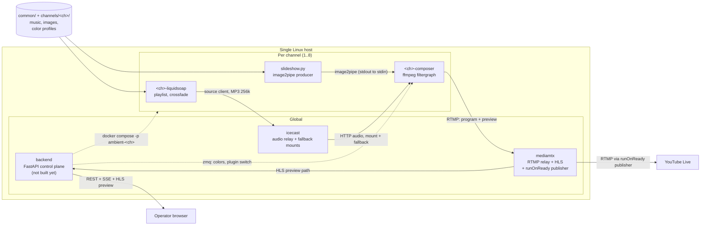

# Architecture

**Status: Phase 1 is built and running on real hardware.** The full streaming path —
Liquidsoap → Icecast → composer → MediaMTX → YouTube, plus the HLS preview — has been
verified live. Measured steady state on a running 720p channel: `speed=0.996x`,
3085–3137 kbits/s, `drop_frames=0`, `dup_frames=0`.

**What is not built yet**, and is described below as the design it will be built to:

| Not built | Where it is described |
|-----------|-----------------------|
| FastAPI control plane (REST + SSE) | [§5](#5-control-plane) |
| Operator web UI | [§5.3](#53-frontend) |
| Watchdog | [§5](#5-control-plane), [§4](#4-end-to-end-data-flow) |
| Scheduler | [§5](#5-control-plane) |
| Colour-profile extraction | [§2.4](#24-colors-runtime-commands-over-zmq) |
| Presets and bumpers | [§5](#5-control-plane) |

`backend/ambient/` currently holds the config layer, the media resolver, the FFmpeg command
builder, the ZMQ validator and the Compose renderer. They are driven by
`python -m ambient.compile <channel>` — a CLI, not a running service. Channels are started by
hand with `scripts/channel.sh` ([§5.1](#51-channel-lifecycle)).

**Every measured number below was observed on real hardware.** Phase 0 numbers come from the
spike harnesses in `spikes/s1-liquidsoap-transport/` through `spikes/s5-mediamtx-relay/`;
Phase 1 numbers come from the running stack. Three claims in earlier drafts of this document
were disproved by measurement and have been corrected:

| Was claimed | Measured |
|-------------|----------|
| Liquidsoap serves the composer over `output.harbor`, so a blip is just a reconnect | The composer's **output stalls 18.19 s** on a 9.41 s outage and never catches up. Icecast replaces harbor — see [§2.2](#22-audio-a-separate-process-behind-an-icecast-relay). |
| MediaMTX holds the YouTube session open across a composer restart | MediaMTX **terminates readers** when the publisher changes. The relay bounds the gap; it does not remove it — see [§2.6](#26-the-relay-a-bounded-restart-gap-not-a-restart-proof-session). |
| The YouTube publisher probes with `-analyzeduration 500000 -probesize 250000` | 500 ms is **shorter than the composer's 2-second GOP**, so `-c copy` forwarded a stream with no SPS/PPS and YouTube dropped it after ~15 s, every cycle. Shipped defaults are now 3 s / 4 MB — see [§2.6](#26-the-relay-a-bounded-restart-gap-not-a-restart-proof-session). |

## 1. What the system is

ambient-streamer is a headless, multi-channel, 24/7 ambient music streaming system for
YouTube Live. It runs unattended on a single Linux host and is operated entirely through a
browser.

Each **channel** is one continuous YouTube broadcast. A channel pairs:

| Piece | Role |
|-------|------|
| Liquidsoap audio engine | Owns the playlist, track order, crossfades, and loudness. Publishes a continuous MP3 stream to the shared Icecast relay, which is what the compositor reads. |
| FFmpeg compositor | Renders a color-adaptive image slideshow plus real-time audio visualization, encodes, and publishes over RTMP. |
| Color profile | Per-image palette data that drives the visualization and background colors so they track the current image. Extraction is not built yet. |
| HLS preview | A second, low-resolution feed the composer publishes alongside the program, which an operator can watch without touching the YouTube broadcast. It is a **second encode**, and it is why a channel costs what [§7.2](#72-capacity) says it costs. |

A **FastAPI control plane** will orchestrate all channels: render each channel's Compose file,
start and stop channels, watch their health, restart what dies, apply scheduled changes, and
stream live state to the operator UI. It is not built ([§5](#5-control-plane)); today a channel
is compiled with `python -m ambient.compile` and started with `scripts/channel.sh`.

The system has no interactive console, no desktop session, and no manual step in normal
operation. An operator's eventual only interface is the web UI and, at install time, a shell
script.

## 2. The central constraint

> **A 24/7 stream must never restart FFmpeg.**

This single rule explains most of the design. It follows from two facts that pull against each
other.

**Fact one: YouTube ends a broadcast after a sustained gap in data.** A live broadcast is a
session, not a file. If the RTMP publisher disconnects and stays gone, YouTube marks the
stream unhealthy, then ends the broadcast. Ending a broadcast is not recoverable in place —
the video ID changes, watch-page continuity is lost, and any accumulated concurrent viewers
are gone. A 24/7 channel that restarts its encoder to change a color is not a 24/7 channel.

**Fact two: an FFmpeg filtergraph is fixed at launch.** The graph is parsed once, from
`-filter_complex`, before the first frame. Filters cannot be added, removed, or rewired while
the process runs. Inputs cannot be added. The output URL cannot change. Only a narrow set of
filter *parameters* can be mutated at runtime.

So every feature an operator can change live must be designed around one of a small number of
escape hatches. The design question is never "how do I restart FFmpeg cleanly?" — it is
"which escape hatch does this feature use?"

### 2.1 The escape hatches

| Live change | Mechanism | Why it works | Measured |
|-------------|-----------|--------------|----------|
| Playlist, track order, crossfade | Liquidsoap owns audio in a separate process, behind an Icecast relay | FFmpeg sees one never-ending HTTP audio input that terminates on Icecast, not on Liquidsoap. Liquidsoap can reload its playlist, or restart entirely, without FFmpeg noticing. | S1: `reload_mode="watch"` picked up a new file mid-run with the Liquidsoap PID unchanged, 0.0 % silence over 234.8 s. A full Liquidsoap kill and restart cost **0 s** of composer output through the Icecast fallback mount. |
| Image set, image order, transitions | Python producer feeds `-f image2pipe` | FFmpeg sees one never-ending stream of frames on stdin. The producer decides which image, in what order, with what crossfade. | S2: images added and removed mid-run with the FFmpeg PID unchanged and **no gap**. |
| Colors | `zmq` filter plus runtime commands | Mutates parameters on filter instances in the running graph. No re-parse, no restart. | S3: latency is exactly **one frame**, deterministic. Ceiling is one command per frame, **~31.5 commands/s**. |
| Visualization plugin | `streamselect` between pre-instantiated graphs | Every plugin's branch exists in the graph from launch. Switching changes which branch is routed to the output. | S4: **frame-exact** — a clean single-frame cut, no dropped frames. `astreamselect` behaves identically for audio. |
| Anything that genuinely needs a restart | MediaMTX relay plus a supervised publisher | The relay bounds the gap and keeps the stream key off the composer. It does **not** hold the YouTube session open. | S5: best floor **1.03 s** on the YouTube leg; kill-and-restart 5.14 s; an unsupervised publisher dies permanently on the first swap. Phase 1: the publisher reattaches in **207 ms**, but a full composer `docker restart` still cost **13.7 s** on the YouTube leg — the container restart, not the publisher, is what dominates. |

**The decision rule:** before adding a feature that changes what the stream looks or sounds
like, decide which row it lands in. If the answer is "restart FFmpeg", the design is wrong —
change the design, not the rule. Only the first four rows are gap-free. The last row costs
seconds even when everything is done correctly, which is why it is the last resort and not a
general-purpose mechanism.

### 2.2 Audio: a separate process, behind an Icecast relay

Liquidsoap runs in its own container. It does **not** serve the composer directly. It connects
to a global Icecast container as a *source client*, and the composer reads
`http://icecast:8081/<channel>` over HTTP.

The obvious design — `output.harbor` plus FFmpeg reconnect flags — was measured in spike S1 and
**rejected**. Three transports were tested against a `docker kill` plus `docker start` of
Liquidsoap, source down 9.41 s:

| Transport | FFmpeg process | Composer output |
|-----------|----------------|-----------------|
| Named pipe / FIFO | **dies** on writer EOF | gone; restarting Liquidsoap does not revive it |
| `output.harbor` + `-reconnect` | survives | **stalls 18.19 s**, then runs ~18 s behind wallclock permanently |
| Icecast relay + `fallback-mount` | survives | **0 s gap, 0.00 % silence** |

Harbor fails because FFmpeg's reconnect backoff ladder is 0, 1, 3, 7, 15, 31, 63 s and lands on
whichever step first falls after the mount returns. A 9.4 s outage misses the 7 s step and waits
for the 15 s one: **the gap is roughly double the outage, not equal to it.** No FFmpeg-side flag
fixes it — `-use_wallclock_as_timestamps`, `aresample=async=1`, and `aresample=async=1000` all
behave identically, because the stall is in the demuxer before any filter sees a frame. And it is
not only an audio failure: the composer freezes its *video* output too, which is exactly the
sustained gap in RTMP data that §2 exists to prevent.

Icecast works because the composer's HTTP connection terminates on Icecast, which never
restarts. When Liquidsoap disconnects, Icecast moves the listener to a `fallback-mount` and
moves it back when the source returns. FFmpeg logged **no reconnect lines at all** across a full
kill-and-restart cycle.

**The payload is MP3 256 kbps CBR, 44.1 kHz, stereo** — `%mp3(bitrate=256, samplerate=44100,
stereo=true)`. This is fixed, not negotiated. S1 measured four encoders across a reconnect:

| Encoder | Audio after a reconnect |
|---------|-------------------------|
| `%mp3(bitrate=256)` | **clean** — 0.0 % silence, no fragments |
| `%vorbis(quality=0.6)` | broken — 67 % silence, 55 fragments, non-monotonic DTS |
| `%ogg(%flac(...))` | broken — 60 % silence, `CRC mismatch!` |
| `%wav` | usable — one clean silence covering the outage; the lossless fallback if ever needed |

MP3 frames carry a sync word, so any resume point in the byte stream is recoverable. Ogg cannot
resync, because a reconnect splices a fresh logical stream with fresh headers into a demuxer that
is already mid-stream. This matters for Icecast specifically and not just for reconnect: the
fallback-mount switch *is* such a mid-connection stream change, and the Icecast run crossed it
twice with zero silence. 44.1 kHz is also the single clock the `youtube-ingest` skill mandates.

Two flag groups on the composer's audio input are **mandatory**, both measured:

| Flags | Without them |
|-------|--------------|
| `-probesize 32k -analyzeduration 500000` | MP3 probing costs **8.4 s** before FFmpeg emits its first sample |
| `-reconnect_on_network_error 1` | The composer dies at startup with `Error opening input files: Connection refused` |

The second is a startup-ordering fix, not a resilience one. Compose starts both containers at
once, so the composer *will* find nothing listening; plain `-reconnect` covers a disconnect
during a stream and not the initial connect. Note that `-reconnect_delay_max` is the give-up
threshold, not a per-attempt cap: it bounds the whole retry window, so it is not the knob it
looks like. The exact flag set is fixed by
[`docs/contracts/audio-transport.md`](contracts/audio-transport.md) and is what
`ffmpeg/entrypoint.sh` ships.

Playlists use `playlist(reload_mode="watch")`, so adding or removing a track on disk is picked
up by Liquidsoap on its own schedule. S1 confirmed this: a file copied into the media directory
mid-run appeared in normal rotation with the Liquidsoap PID unchanged and no break in the
stream. Nothing downstream restarts. Crossfade, replaygain, and loudness normalization all live
on this side of the boundary — they are audio concerns, and audio concerns belong to the process
that can change them live.

The tradeoff is one extra container per channel plus one global container, and two hops instead
of none. That is accepted: it is what makes the playlist editable, and the audio engine
restartable, without the encoder ever noticing.

### 2.3 Images: a producer on a pipe

The slideshow is not built from FFmpeg's concat demuxer or a `glob` pattern, because both fix
the image set at launch. Instead a Python producer writes encoded frames to stdout and FFmpeg
reads them with `-f image2pipe`.

This inverts the ownership: the producer, not the filtergraph, owns image order, dwell time,
crossfade rendering, and the response to a changed media directory. Adding images to a channel
becomes a filesystem operation plus a producer-side rescan, with no effect on the encoder.
Spike S2 measured exactly that: images were added to and removed from the directory mid-run with
the FFmpeg PID unchanged and no gap in output. The producer encodes JPEG at quality 88, 4:4:4
chroma, at a 10 fps producer rate.

Because a slideshow produces frames far below the output frame rate, the graph pairs `fps`
with `realtime`. **`realtime` is mandatory, not an optimization.** Without it, S2 measured the
muxer releasing up to **53 frames — 1.77 s of media — inside a 0.5 s wall-clock window**. That
burst is precisely what makes YouTube buffer or stall, and it does not reproduce as a fault in
local playback. See the `youtube-ingest` skill for the full rationale.

### 2.4 Colors: runtime commands over ZMQ

A `zmq` filter instance in the graph listens on a socket. The backend sends messages that
target a named filter instance and set one of its parameters. Filters are therefore
instantiated with explicit labels (`filtername@label`) so they can be addressed later.

Color profiles are extracted from the images ahead of time and stored as JSON beside the image
tree they describe. As the slideshow advances, the backend applies the incoming image's palette
by sending commands for the affected parameters. The visualization and background track the
artwork without a graph change.

The mechanism is proven and the graph is already built for it — the composer instantiates
`zmq@ctl`, `eq@eq` and `hue@hue` at launch. What is missing is the extractor and the applier:
nothing generates profile JSON yet, and nothing sends the commands.

Spike S3 measured the mechanism. Command latency is **exactly one frame** and deterministic — a
command lands on the next frame boundary, never later, never smeared. The ceiling is therefore
one command per frame, about **31.5 commands/s** at the output frame rate.

That ceiling never binds, because smooth transitions are **not** built by streaming a command
per frame. They are built with `eq` and `hue` **time expressions**: a single command installs a
self-animating ramp that the filter evaluates per frame on its own. A fade is one command, not a
command stream. This imposes one launch-time requirement: `eq` must be instantiated with
`eval=frame`, because `eval` is not itself commandable, so a graph that omits it cannot be given
a time expression later.

Only parameters whose filters implement a command interface are addressable this way. That
list is part of the media-pipeline contract, not something a caller may assume. `drawbox` is
excluded from the live colour surface for a separate reason — see [§2.7](#27-two-defects-the-escape-hatches-carry).

### 2.5 Visualization plugins: pre-instantiated branches

A plugin is a filtergraph fragment with a fixed pad contract, so any plugin can occupy the
same position in the graph. All configured plugin branches are instantiated at launch and run
concurrently; `streamselect` chooses which one reaches the encoder.

The honest cost: every instantiated branch consumes CPU whether or not it is on screen. The
number of plugins loaded per channel is therefore a capacity decision, not a free one. The
benefit is that switching visualization is a single runtime command instead of a broadcast
restart.

Spike S4 measured the switch as **frame-exact**: a clean single-frame cut with no dropped
frames and no restart. `astreamselect` behaves identically for audio. This is worth stating
plainly because it settles a question the relay was once thought to answer — a plugin swap is
gap-free on its own and never needed a restart domain around it.

One degenerate case falls out of the implementation: `streamselect` requires at least two
inputs, so a channel with a single hot plugin has no selector in its graph at all. The Phase 1
channel runs one plugin (`showfreqs-bars`), which is also the configuration the capacity number
in [§7.2](#72-capacity) was measured against.

### 2.6 The relay: a bounded restart gap, not a restart-proof session

Some changes cannot be made live — a resolution change, a frame-rate change, an encoder swap,
or a crash. For those, the composer must be relaunched, and relaunching a publisher that talks
directly to YouTube ends the broadcast.

MediaMTX sits between them. The composer publishes two RTMP streams per channel — the program
feed on `<channel>` and a low-resolution operator feed on `<channel>/preview`. MediaMTX relays
the program feed on to YouTube and serves the preview path as HLS. It does not transcode.

**The relay does not hold the YouTube session open.** Spike S5 measured MediaMTX 1.9.3
terminating *reader* connections whenever the publisher on a path changes:

```
INF [path spike01] closing existing publisher
INF [RTMP] [conn ...60384] closed: terminated    <- this is the reader
```

Four variants were measured:

| Variant | Composer swap | Relay path outage | YouTube-leg outage | YouTube publisher |
|---------|---------------|-------------------|--------------------|-------------------|
| A — bare ffmpeg publisher | kill + 2 s restart | 2.26 s | ≥ 11.01 s, never recovered | **dead** |
| B — supervised loop | kill + 2 s restart | 2.26 s | 5.14 s | relaunched |
| C — bare ffmpeg publisher | make-before-break | **0 s — path never dropped** | ≥ 10.80 s, never recovered | **dead** |
| D — fast-probe supervised loop | make-before-break | **0 s** | **1.03 s** | relaunched |

Variant C is the decisive one: the relay path never went not-ready, and the reader was killed
anyway. **Path continuity at the relay does not imply reader continuity.** MediaMTX has a
`fallback:` key, but it is a read-time redirect — "if the stream is not available, send readers
to this path" — not a splice. It cannot rescue an already-connected reader. There is no
Icecast-style fallback mount in MediaMTX, so the trick that makes §2.2 gap-free is not available
here.

Two consequences follow.

**The YouTube publisher must be externally supervised.** FFmpeg's `-reconnect*` flags do
not apply to the RTMP demuxer, so a bare `ffmpeg -i rtmp://relay/<ch> -f flv <youtube-url>` dies
permanently on the first composer swap — variants A and C. Supervision cannot come from FFmpeg
itself; it has to come from outside the process.

**Composer swaps should be make-before-break.** Start the replacement composer, let it publish,
then stop the old one. Kill-then-restart costs 5.14 s on the YouTube leg even when the publisher
is supervised; make-before-break with a fast-probe publisher costs 1.03 s. This is a property of
the supervisor, which is not built yet — `scripts/channel.sh restart` is stop-then-start, and a
plain `docker restart` of a Phase 1 composer was measured at **13.7 s** on the YouTube leg.

#### How the publisher is built

The publisher is a MediaMTX `runOnReady` hook. MediaMTX spawns it when a channel's program path
becomes ready and kills it when the path stops being ready; that lifecycle *is* the supervision.

| Piece | File |
|-------|------|
| Hook registration and restart policy | `docker/mediamtx.yml` — `runOnReady`, `runOnReadyRestart: yes` |
| The publisher itself | `docker/publish-youtube.sh` — `ffmpeg -c copy` from the local relay to YouTube |
| Image | `docker/Dockerfile.mediamtx`, built from `bluenviron/mediamtx:1.9.3-ffmpeg` |
| Keeping the key out of `argv` | `docker/argv-shim.c`, preloaded so the key never appears in `ps` or `docker inspect` |

**Restart supervision is `runOnReadyRestart`, not FFmpeg flags.** That is the whole point: a
bare publisher dies permanently on the first composer restart (variants A and C), so the thing
that brings it back has to be the process manager above it.

**Measured: path-ready → publishing is 207 ms.** In a full composer `docker restart` measured at
13.7 s of YouTube-leg outage, the publisher accounted for 207 ms of it. Everything else was the
container coming back.

The publisher is **not** a third container per channel. One relay container hosts every
channel's publisher, so the topology in [§3](#3-container-topology) is unchanged. `channels/` is
bind-mounted read-only into the relay, and the hook resolves the stream key for `$MTX_PATH` at
path-ready time — so adding a channel, or filling in a key that was left blank, needs no relay
restart. A channel whose key is still empty parks and re-checks rather than hot-looping.

#### The probe flags: a measured correction

An earlier draft of this document specified `-fflags nobuffer -analyzeduration 500000
-probesize 250000` for the publisher. **That was wrong, and it was measured wrong.**

500 ms is shorter than the composer's 2-second GOP, so the publisher usually attached before it
had seen an IDR frame. `-c copy` then emitted a stream carrying no SPS/PPS. YouTube accepted
that stream and dropped it about 15 s later — every cycle, which reads as an intermittent
ingest fault rather than a probe bug.

| Probe setting | Video parameters recovered |
|---------------|----------------------------|
| `nobuffer` + 500 ms / 250 KB | 1 of 3 runs |
| 500 ms / 250 KB without `nobuffer` | 0 of 3, then 1 of 3 |
| `nobuffer` + 2.5 s / 1 MB | 3 of 3 |

Shipped defaults are now **3 s / 4 MB**, overridable through
`AMBIENT_PUBLISH_ANALYZEDURATION` and `AMBIENT_PUBLISH_PROBESIZE`. `nobuffer` was kept — the
second row shows it was not the cause. Both values are *caps*, not waits: FFmpeg returns as
soon as it has the parameters, so the 207 ms reattach is unaffected by raising them.

> **The rule:** the publisher's `analyzeduration` must exceed the composer's GOP duration, or
> `-c copy` will forward a stream with no decoder configuration.

This is unrelated to the `-probesize 32k -analyzeduration 500000` on the **Icecast MP3 input**
in [§2.2](#22-audio-a-separate-process-behind-an-icecast-relay). That pair is a different input,
a different container format, and a separately measured fix for an 8.4 s probe delay. The two
must not be conflated, and the Icecast values must not be raised to match the publisher's.

#### Then why keep the relay?

Because the relay buys three things that are worth one global container and one extra hop:

| What it buys | Detail |
|--------------|--------|
| A deterministic gap instead of a backoff-driven one | A publisher pointed straight at YouTube is back on FFmpeg's doubling ladder — the same mechanism that turned a 9.4 s audio outage into an 18.19 s stall in §2.2. Behind the relay the reattach is 207 ms, every time. |
| Independent legs | Program and preview are separate paths on the relay. An operator opening a preview reads a different path entirely and never touches the broadcast leg. |
| Credential isolation | The stream key lives in one global service, is read from `channels/<name>/.env` at path-ready time, and is passed to FFmpeg through the argv shim. Composer containers are rendered, restarted, and scaled per channel and never hold it. |

**And the rule in §2 is now more important, not less.** The relay makes the publisher's
contribution to a restart 207 ms; it does not make the restart free — the measured cost of
restarting a composer is still 13.7 s, dominated by the container. The only mechanisms measured
at *zero* are the ones that avoid the restart entirely — `streamselect` switching
pre-instantiated graphs frame-exactly (§2.5), the producer changing images with the FFmpeg PID
unchanged (§2.3), and Icecast's fallback mount covering a full audio-engine restart (§2.2).
Plugin swaps in particular never needed the relay at all. Every feature that can be built on an
escape hatch must be; the relay is what is left over for the cases that genuinely cannot.

### 2.7 Two defects the escape hatches carry

Both were found in Phase 0. Both constrain the backend rather than the media pipeline, so they
are recorded here rather than left in a lane document.

**1. A malformed ZMQ message aborts FFmpeg.** Any message that does not parse into at least two
whitespace-separated tokens causes heap corruption and terminates the process with exit 134.
The `zmq` filter's default `bind_address` is `tcp://*:5555` — every interface, no authentication
— so in the default configuration a single malformed packet is a remote kill of the encoder.
Three requirements follow: bind the socket to loopback or a private Docker network only, never
publish the port to the host, and treat the client that composes commands as a security
boundary that validates every message before it is sent.

**2. A failed `drawbox` command disables that filter instance permanently.** `drawbox` re-runs
its `init()` on every runtime command and does not roll back on failure, so one rejected value
leaves that instance broken for the remaining life of the process. `eq` and `hue` do not have
this flaw. `drawbox` is therefore not usable as the live colour surface; palette-driven colour
goes through `eq` and `hue`.

## 3. Container topology

Two containers per channel, plus three global containers.

| Scope | Container | Responsibility |
|-------|-----------|----------------|
| Global | `backend` | FastAPI control plane: REST, SSE, static operator UI, supervisor, watchdog, scheduler |
| Global | `icecast` | Audio relay. One instance serves every channel; each channel gets its own mount plus its own fallback mount (§2.2) |
| Global | `mediamtx` | RTMP relay of the program feed to YouTube; HLS server for the per-channel preview path (§2.6) |
| Per channel | `<ch>-liquidsoap` | Playlist, crossfade, loudness; publishes to Icecast as a source client |
| Per channel | `<ch>-composer` | Slideshow producer plus FFmpeg compositor and encoder |

At the supported maximum of 8 channels that is **19 containers**:

| Channels | Per-channel containers | Global containers | Total |
|----------|------------------------|-------------------|-------|
| 1 | 2 | 3 | 5 |
| 4 | 8 | 3 | 11 |
| 8 | 16 | 3 | 19 |

The third global container is a Phase 0 correction: the design assumed Liquidsoap would serve
the composer directly and needed no relay. It cannot (§2.2), so Icecast is now load-bearing.

The supervised YouTube publisher runs **inside the `mediamtx` container**, spawned per channel
by `runOnReady` (§2.6). It is a process, not a container, so the counts above are the counts
whether or not a channel is live.

A container-per-concern decomposition — separate containers for the slideshow producer, the
color applier, the encoder, the relay, and the metrics exporter — would put the same workload
in roughly 40 containers at 8 channels. That is rejected. The slideshow producer is a pipe
away from FFmpeg and gains nothing from a process boundary, and every extra container is
another supervised object, another restart policy, and another failure mode on a host that
must run unattended for months.

The splits that do exist each buy something specific: Liquidsoap is separate because it is the
audio escape hatch, Icecast is separate because it is what makes that hatch gap-free, and
MediaMTX is separate because it bounds the cost of a composer restart and keeps the stream key
out of the per-channel containers.

### 3.1 Data flow



Solid arrows carry media. Dashed arrows carry control. The two relays are there for different
reasons: Icecast makes an audio-engine restart invisible (§2.2), MediaMTX bounds the cost of a
composer restart (§2.6). Only the first is gap-free.

Every solid arrow is built and running. The dashed control arrows are not: in Phase 1 the
Compose file is rendered by `python -m ambient.compile <channel>` and the channel is started by
`scripts/channel.sh start <channel>` (§5.1).

## 4. End-to-end data flow

1. **Audio origin.** Liquidsoap reads the channel's generated `playlist.m3u` with a watched
   playlist, applies crossfade and loudness normalization, and connects to the global Icecast
   container as a source client on a mount named for the channel, encoding MP3 256 kbps CBR /
   44.1 kHz / stereo. Its output must be infallible (`mksafe` outermost) — a bad file must never
   take down the mount the composer is attached to.
2. **Audio ingest.** The composer takes `http://icecast:8081/<channel>` as an FFmpeg input with
   `-probesize 32k -analyzeduration 500000 -reconnect 1 -reconnect_streamed 1
   -reconnect_on_network_error 1 -reconnect_delay_max 5`, exactly as
   [`contracts/audio-transport.md`](contracts/audio-transport.md) fixes them. Those flags are
   for startup ordering and for an Icecast outage, not for a Liquidsoap restart; a Liquidsoap
   restart is absorbed by the fallback mount and the composer never disconnects (§2.2). Audio is
   resampled to a single clock, per the `youtube-ingest` skill.
3. **Image origin.** The slideshow producer reads the channel's generated `images.list`, orders
   the images, renders crossfades, and writes encoded frames to stdout.
4. **Image ingest.** FFmpeg reads those frames with `-f image2pipe`, then paces them with
   `fps=<rate>` followed by `realtime`.
5. **Color application.** Color profile JSON for the current image is read by the backend,
   which sends ZMQ runtime commands to the named filter instances that carry palette-driven
   parameters. The graph is not re-parsed.
6. **Visualization.** The audio stream also feeds the visualization branches. All configured
   plugin branches run; `streamselect` routes the active one into the composite.
7. **Composite and encode.** Slideshow, visualization, and any overlay are composited, then
   encoded with the CBR, fixed-GOP, no-scene-cut settings the `youtube-ingest` skill
   specifies, muxed to FLV.
8. **Publish.** The composer pushes two RTMP streams to `mediamtx` on the internal Docker
   network: the program feed on `<channel>` and a low-resolution operator feed on
   `<channel>/preview`. It never holds the YouTube stream key.
9. **Fan-out.** MediaMTX's `runOnReady` hook spawns the publisher for that path, which reads the
   program feed and pushes it to YouTube's ingest endpoint with the channel's stream key;
   MediaMTX serves the preview path as HLS. Supervision comes from `runOnReadyRestart`, not from
   FFmpeg: its reconnect flags do not apply to the RTMP demuxer, so a bare publisher dies
   permanently the first time the composer restarts. The publisher probes with 3 s / 4 MB, which
   must stay longer than the composer's 2-second GOP (§2.6). Measured path-ready to publishing:
   **207 ms**.
10. **Preview.** The backend re-exposes that HLS rendition to the operator UI. Watching a
    channel costs composer-side encoding of a second, smaller feed — paid continuously whether
    or not anyone is watching, and the single largest reason a channel costs what
    [§7.2](#72-capacity) says it costs — and never interferes with the broadcast leg.

Two properties of this chain matter more than the individual steps:

- **No control path touches the media path.** Control reaches the composer only as ZMQ
  parameter commands, and reaches Liquidsoap only through files on disk it already watches.
- **The stages do *not* fail independently — the audio input gates the whole composer.** S1
  measured an audio-source outage freezing the composer's video output too, for the entire
  reconnect window. That is why the audio path is built on Icecast rather than on reconnect, and
  it means "the process is alive" is not a health signal: the watchdog must verify that the
  composer's output is *advancing*. A dead composer, by contrast, is bounded rather than
  absorbed — the publisher reattaches in 207 ms once the composer is publishing again, but the
  measured end-to-end cost of restarting a composer container is 13.7 s on the YouTube leg, and
  an ended broadcast if the publisher is not supervised.

### 4.1 Where media comes from

Two read-only trees feed a channel: the shared library at `common/` (mounted `/media/common`)
and the channel's own directory (mounted `/media/channel`). Media used by several channels lives
in `common/` and is stored once. Being in `common/` makes a file *available* to a channel, not
used by it — selection is per channel.

`audio.tracks` and `images.slides` in a channel's `config.yaml` each take three forms, mixable
in one list:

| Form | Meaning | Directory watched |
|------|---------|-------------------|
| Omitted or empty | everything under the channel's own `audio/` or `images/`, recursively. It does **not** pull in `common/` | yes |
| Explicit paths | exactly those files, in that order | no |
| Glob (`*` one level, `**` recursive) | everything matching, re-expanded as the folder changes | yes |

Explicit lists are deliberately not watched: the operator asked for exactly those files, and
quietly appending to a hand-curated playlist would be wrong. The watched forms are what make
"drop a file in and it appears" work without restarting anything.

Selection compiles to `channels/<name>/playlist.m3u` and `channels/<name>/images.list`, both
holding absolute in-container paths that may span both trees. Liquidsoap watches the playlist
file; the producer rescans the image list between slides. Neither rewrite interrupts the stream.

**Symlinks cannot be used for this.** A bind mount carries only the directory it is given, so a
symlink from a channel directory into `common/` resolves to a path the container cannot see and
the file fails to open. The selection lists exist to avoid that, not as a stylistic preference.

Full rules — sort order, extension filter, duplicate handling, path validation, colour profile
placement — are in [`contracts/media-selection.md`](contracts/media-selection.md).

## 5. Control plane

The backend is a single FastAPI application. It is the only component that talks to Docker.
**It is not built yet.** What exists in `backend/ambient/` today is the offline half — the
modules a CLI needs to turn a channel's configuration into files on disk — with no HTTP server,
no supervision loop, and no Docker socket.

| Module | Responsibility | Built |
|--------|----------------|-------|
| `config.py` / `models.py` | Load and validate configuration; Pydantic models are the schema | yes |
| `media.py` | Resolve selections into `playlist.m3u` and `images.list` (§4.1) | yes |
| `ffmpeg_cmd.py` | Assemble the composer command from lane-supplied fragments; probe encoders with a real test encode | yes |
| `plugins.py` | Discover and validate plugin packs | yes |
| `supervisor.py` | Render per-channel Compose files | rendering only |
| `zmqctl.py` | Validate runtime commands before sending. A malformed one kills FFmpeg (§2.7) | yes |
| `compile.py` | The Phase 1 entry point: `python -m ambient.compile <channel>` | yes |
| `main.py` | Application assembly, router mounting, static UI | no |
| `watchdog.py` | Detect unhealthy channels, restart with exponential backoff. Health is "output is advancing", not "process is alive" (§4) | no |
| `scheduler.py` | Time-based changes (playlist, plugin, preset) | no |
| `colorprofile.py` | Extract palettes from images into profile JSON | no |
| `presets.py` | Discover and validate preset packs | no |
| `events.py` | SSE event hub — in-memory queue plus a lock, no broker | no |
| `metrics.py` | Health and throughput data for the UI | no |

The unbuilt rows are the planned decomposition, owned by the `backend-api` lane.

### 5.1 Channel lifecycle

The backend does not run FFmpeg or Liquidsoap directly. It generates Compose files and lets
Docker own process supervision.

**Today**, both halves are manual:

```bash
python -m ambient.compile lofi          # writes playlist.m3u, images.list, docker-compose.yml
scripts/channel.sh start lofi           # docker compose up -d for that channel only
```

`scripts/channel.sh` also does `stop`, `restart`, `status`, `logs` and `config`, each scoped to
the `ambient-<channel>` Compose project so it cannot reach the global stack or anything else on
the host.

**That script exists for a specific reason.** `docker compose` resolves the implicit `.env`
relative to the *Compose file's* directory. A per-channel Compose file lives in
`channels/<name>/`, so Compose finds only that channel's `.env` and never the root one — every
`${ICECAST_SOURCE_PASSWORD}` in the template then resolves to empty and the channel comes up
mute against a relay that rejects it. Both files have to be named explicitly, root first so the
channel file wins on any shared key:

```bash
docker compose --project-name ambient-lofi \
  --env-file .env --env-file channels/lofi/.env \
  --file channels/lofi/docker-compose.yml up -d
```

**Eventually**, the backend does the same thing on the operator's behalf:

1. Operator creates or edits a channel through the UI.
2. The supervisor renders `docker/compose.channel.yml.j2` into
   `channels/<name>/docker-compose.yml`. Generated Compose files are gitignored.
3. The supervisor runs `docker compose -p ambient-<name>` against that file, giving each channel
   its own Compose project namespace.
4. Docker restarts crashed containers (`restart: unless-stopped`); the watchdog handles the
   cases Docker cannot see, such as a process that is running but no longer producing frames.

A replacement composer should be started **before** the outgoing one is stopped whenever the
restart is planned rather than a crash — make-before-break is what holds the YouTube-leg gap at
1.03 s instead of 5.14 s (§2.6). No current tool does this; `scripts/channel.sh restart` is
stop-then-start.

Rendering a file rather than constructing containers through the API is deliberate. The
generated Compose file is readable, diffable, and an operator can run it by hand when the
backend is down — which, in Phase 1, is the only way it is run.

### 5.2 Live updates to the browser

Not built. Live state will reach the UI over **Server-Sent Events**, backed by an in-memory
queue and a lock. There is no message broker and no WebSocket upgrade. Channel state changes,
health transitions, and log lines are all events on that stream; the browser applies them to the
DOM without a reload.

### 5.3 Frontend

Not built; `frontend/` does not exist yet. The operator UI will be plain HTML, CSS, and
JavaScript served directly by FastAPI. There is no npm, no bundler, and no framework.
Third-party libraries — for example an HLS playback library for the preview — are vendored as
single files under `frontend/vendor/` and committed.

Server-supplied strings (channel names, track titles, file names) are rendered with
`textContent`, never `innerHTML`. Those strings come from disk and from operator input, and
this is the one place in the project where an XSS bug is realistically reachable.

### 5.4 Security posture

| Property | Consequence |
|----------|-------------|
| The backend mounts the Docker socket | The backend is root-equivalent on the host. It binds to localhost by default and requires authentication. |
| Channel names reach Docker and the filesystem | Every Docker-touching endpoint treats its input as hostile and sanitizes before interpolation. |
| A malformed ZMQ message kills FFmpeg | Measured: a message that does not parse into two whitespace-separated tokens aborts the encoder with exit 134, and the filter's default bind is all interfaces with no auth. The composer binds the socket to `127.0.0.1` inside its own container and never publishes the port; `zmqctl.py` validates every command before sending it and is a security boundary, not a convenience wrapper (§2.7). |
| Stream keys are secrets | Held in `channels/<name>/.env`, `chmod 600`, gitignored. Only the relay reads one, and only when a path goes ready: no composer container is given the key, so it is absent from `docker inspect` on every per-channel container. Inside the relay it is staged in a `0600` tmpfs file and reaches FFmpeg through the preloaded `docker/argv-shim.c`, so it never appears in `argv`, in `ps`, or in a log line. |
| The Icecast source password is a secret | Same handling as a stream key. It is what authorizes a source client to take over a channel's mount. Note that it *is* passed to the Liquidsoap container as an environment variable, because a source client needs it at connect time. |
| Neither relay publishes a host port | Icecast and MediaMTX are reachable only from the internal Docker network. RTMP 1935, HLS 8888 and the MediaMTX API 9997 are not exposed to the LAN. |
| The watchdog restarts channels | Backoff is exponential and retries the same channel. A tight restart loop against YouTube ingest looks like abuse. |

## 6. Lanes and contracts

Work is split into file-disjoint lanes so that agents and contributors can work in parallel
without colliding.

| Lane | Owns |
|------|------|
| `media-pipeline` | `ffmpeg/`, `liquidsoap/`, `plugins/`, `presets/` |
| `backend-api` | `backend/` |
| `frontend` | `frontend/` |
| `infra` | `docker/`, `docker-compose.yml`, `scripts/`, `.github/workflows/` |
| `docs` | `docs/`, `README.md` |

Shared, cross-lane files — `ambient.yaml.example`, `.gitignore`, and everything under
`docs/contracts/` — are edited by the lead only.

`docs/contracts/` is the source of truth for every interface that crosses a lane boundary:

| Contract | Binds |
|----------|-------|
| REST + SSE shapes | `backend-api` ↔ `frontend` |
| Plugin filtergraph pad contract | `media-pipeline` ↔ `backend-api` |
| ZMQ runtime command protocol | `media-pipeline` ↔ `backend-api` |
| Preset and color profile schemas | `media-pipeline` ↔ `backend-api` ↔ `frontend` |
| Per-channel Compose template inputs | `infra` ↔ `backend-api` |

An interface is read from its contract, never inferred from another lane's implementation. A
contract that is wrong or missing is reported to the lead, not changed unilaterally.

One boundary is worth calling out because it looks misplaced: `backend/ambient/ffmpeg_cmd.py`
builds an FFmpeg command line but belongs to `backend-api`. The `media-pipeline` lane supplies
the filtergraph fragments and the contract that describes them; the backend assembles the
final command.

## 7. Encoders

Three encoder profiles are supported. The rate-control intent is identical across all three —
CBR, fixed GOP, no scene-cut keyframes — because that is what YouTube ingest expects. See the
`youtube-ingest` skill for the exact flags and the bitrate ladder.

| Profile | Requires | Docker Desktop / WSL2 | Notes |
|---------|----------|-----------------------|-------|
| `libx264` | CPU only | Yes | Always available. The fallback for everything. |
| `h264_nvenc` | NVIDIA GPU, nvidia-container-toolkit, `--gpus all` | Yes | Consumer GeForce cards cap concurrent encode sessions. |
| `h264_qsv` | Intel GPU, `/dev/dri` passthrough | **No** | Bare-metal Linux only. |

**QSV cannot work on Docker Desktop or WSL2.** `/dev/dri` is not exposed there, so the device
the encoder needs does not exist inside the container. The profile is valid on bare-metal
Linux; the installer detects the platform and does not offer it otherwise. This is a hard
platform limitation, not a configuration problem to work around.

**NVENC works on WSL2** through `--gpus all` plus nvidia-container-toolkit, but consumer
NVIDIA cards limit how many simultaneous encode sessions the driver will grant. Channels
beyond that cap fall back to `libx264` automatically rather than failing to start. A host with
more channels than NVENC sessions is a normal, supported configuration — it just needs the CPU
headroom for the overflow.

Encoder availability is verified by running a **short real encode**, not by reading
`ffmpeg -hide_banner -encoders`. The list is not evidence: on both hosts tested it advertised
`h264_qsv` with no Intel device present. A channel never fails to start because a configured
encoder is absent; it degrades to `libx264` and reports the substitution.

### 7.1 Other host constraints

| Constraint | Why |
|------------|-----|
| Media must not live on `/mnt/c/...` | On Docker Desktop/WSL2 that path is 9p-backed. It is far too slow for continuous reads and will starve a channel. Use a WSL2 ext4 path or a Docker named volume. A CIFS/NFS mount fails the same way. |
| Per-channel CPU quota, memory limit, and GPU assignment are set | One misbehaving channel must not take down the other seven. |
| Base image versions are pinned | A 24/7 service whose FFmpeg build changes silently is a liability. MediaMTX in particular refuses to start on an unknown config key, so the relay image is pinned to `1.9.3-ffmpeg`. |

### 7.2 Capacity

**Measured on a running 7-core host: about 1.5 cores per 720p channel with one hot plugin.**

| Process | Measured |
|---------|----------|
| `<ch>-composer` | 137–142 % of a core |
| `<ch>-liquidsoap` | ~6 % of a core |
| `mediamtx` (global, includes the YouTube publisher) | ~7 % of a core |
| `icecast` (global) | ~0.2 % of a core |

Reserving about one core for the OS and the shared services, that host runs **about four
channels, not five.**

**The reason matters more than the number: the HLS preview is a second encode, not a free tap
off the program encode.** The composer runs two full encode chains — 720p to the relay and 360p
to the preview path — because MediaMTX does not transcode (§2.6). Filtergraph benchmarks measure
one of those and therefore under-predict a real channel by a wide margin. Any capacity estimate
that does not count the preview encode is wrong.

Two other terms scale the number:

- Each hot plugin branch runs whether or not it is on screen (§2.5). The figure above is for
  one.
- 1080p costs more than 720p on both encodes, and the bitrate ladder rises with it.

## 8. Why not X

Every item here is a deliberate deviation from a common default. Each was chosen for a reason
specific to this system.

| Choice | Common alternative | Why not the alternative |
|--------|--------------------|--------------------------|
| SSE | WebSockets | Traffic is one-way: server to browser. SSE reconnects on its own, works through ordinary HTTP proxies, and needs no broker — an in-memory queue and a lock. WebSockets would add a bidirectional protocol and its failure modes for a channel that only ever flows one way. |
| Plain HTML/CSS/JS | SvelteKit or React | The UI is one page with progressive disclosure. A build step would mean npm in the image, a toolchain to keep current, and a compile between editing a file and seeing the result. The operator UI is not the hard part of this system, and it should not be the part with the most dependencies. |
| pip + `pyproject.toml` (setuptools) | Poetry | Poetry is unused everywhere else in this workspace and adds weight to every container image for no gain here. Standard `pyproject.toml` with setuptools installs with the pip that is already in the base image. |
| 2 containers per channel + 3 global | ~5 containers per channel | 19 containers at 8 channels versus roughly 40. The three splits that exist each buy something specific: Liquidsoap is the audio escape hatch, Icecast is what makes that hatch gap-free (measured: 0 s versus 18.19 s), and MediaMTX bounds the cost of a composer restart while keeping the stream key out of the per-channel containers. The YouTube publisher is a process inside the relay rather than a fourth global — or ninth per-channel — container. Splitting the slideshow producer from FFmpeg would replace a pipe with a network hop and add a supervised object per channel for nothing. |
| Stream keys created by hand in YouTube Studio | YouTube Data API broadcast management | API-managed broadcasts require OAuth credentials with broad account scope, carry quota limits, and add an external dependency to channel startup. A stream key is a long-lived string created once per channel. Manual creation keeps the system free of Google API credentials entirely, and there is no automation win when channels are created a handful of times per year. |

## 9. Related documents

The contracts in [`docs/contracts/`](contracts/README.md) are frozen and are the source of
truth for every interface between lanes. They are lead-owned.

These companion documents are planned in this lane and are **not written yet** — this file and
the contracts are all the documentation there is.

| Document | Covers |
|----------|--------|
| `quickstart.md` | Ubuntu Server install through first live channel |
| `plugin-development.md` | Writing a `viz.ffmpeg`, the pad contract, testing a plugin |
| `visualization-filters.md` | `showwaves` / `showfreqs` / `avectorscope` reference |
| `color-profiles.md` | Profile JSON schema, extraction, adding an extractor |
| `api-reference.md` | Every REST endpoint and SSE event |
| `docker-deployment.md` | Compose topology, GPU passthrough, resource limits, secrets |
| `scaling.md` | Adding channels, capacity planning, encoder ceilings |

The `youtube-ingest` skill under `.github/skills/` holds the proven encoder settings and is
the authority for anything on the ingest path.

The Phase 0 spikes are the evidence behind the Phase 0 measurements in this document. Each
directory holds its harness and its raw output. The Phase 1 measurements — 207 ms publisher
reattach, 13.7 s composer restart, the probe-flag table in §2.6, and the capacity figures in
§7.2 — were taken from the running stack rather than a harness.

| Spike | Question it answered |
|-------|----------------------|
| `spikes/s1-liquidsoap-transport/` | What carries audio from Liquidsoap to the composer (§2.2) |
| `spikes/s2-slideshow/` | Does `image2pipe` support a live media directory, and what pacing does it need (§2.3) |
| `spikes/s3-zmq-color/` | What runtime commands can actually do, at what latency and what rate (§2.4, §2.7) |
| `spikes/s4-streamselect/` | How clean is a plugin switch (§2.5) |
| `spikes/s5-mediamtx-relay/` | What does the relay protect against, and what does it not (§2.6) |
